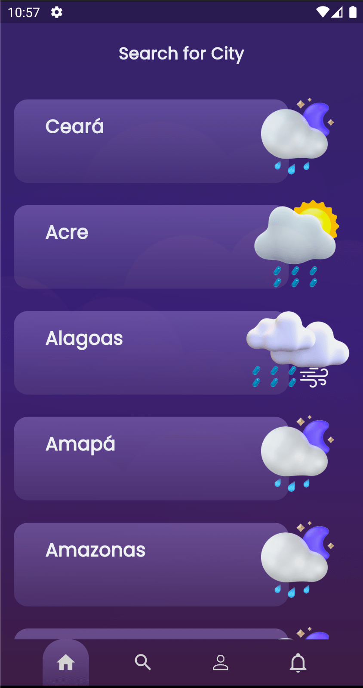
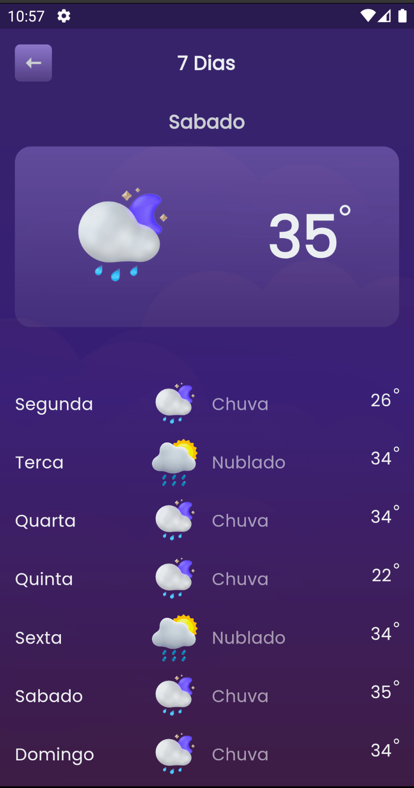
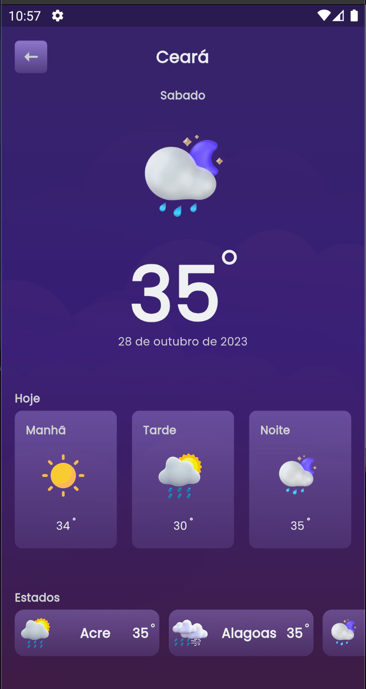

# Weather Today App

## Overview

Weather Today App is a mobile application built using the Flutter framework. It provides users with weather forecasts for different locations, including real-time weather conditions, temperature forecasts, and more. The app is designed with a visually appealing and intuitive interface.

## Features

- **Location-based Weather**: Get weather forecasts for different cities and states.

- **Real-time Data**: Stay up-to-date with real-time weather data.

- **Seven-Day Forecast**: View weather forecasts for the next seven days.

- **Detailed Information**: Access detailed information, including temperature, weather conditions, and more.

- **Beautiful Visuals**: The app features a visually appealing design with background images and weather icons.

- **Interactive**: Users can interact with the app to view weather information for various locations and timeframes.

## Screenshots





## Installation

Follow these steps to set up and run the Weather Today App:

1. Clone the repository to your local machine:
   ```
   git clone https://github.com/your-username/weather-today-app.git
   ```

2. Navigate to the project directory:
   ```
   cd weather-today-app
   ```

3. Install dependencies using Flutter:
   ```
   flutter pub get
   ```

4. Run the app:
   ```
   flutter run
   ```

Ensure that you have Flutter and Dart SDK installed on your machine before running the app.

## Usage

1. Upon opening the app, you'll be presented with a list of cities. Click on a city to view its weather forecast.

2. Explore detailed weather information for the selected city, including the current temperature and seven-day forecasts.

3. Use the footer menu to navigate between different sections of the app.

4. Enjoy the visually appealing design and smooth user experience.

## Technologies Used

- **Flutter**: The app is developed using the Flutter framework, allowing for cross-platform compatibility.

- **Dart**: The programming language used for building the app.

- **Lottie**: Lottie animations are used for adding dynamic visuals to the app.

- **SVG**: Scalable Vector Graphics (SVG) are used for displaying weather icons.

## Contributors

- [Raniere Lima](https://github.com/ranierelm) - Mobile Developer

## License

This project is licensed under the MIT License - see the [LICENSE](LICENSE) file for details.

## Acknowledgments

- The Weather Today App was inspired by the need for a user-friendly weather forecast application with an emphasis on aesthetics and usability. Special thanks to the Flutter community and the various packages that contributed to this project.